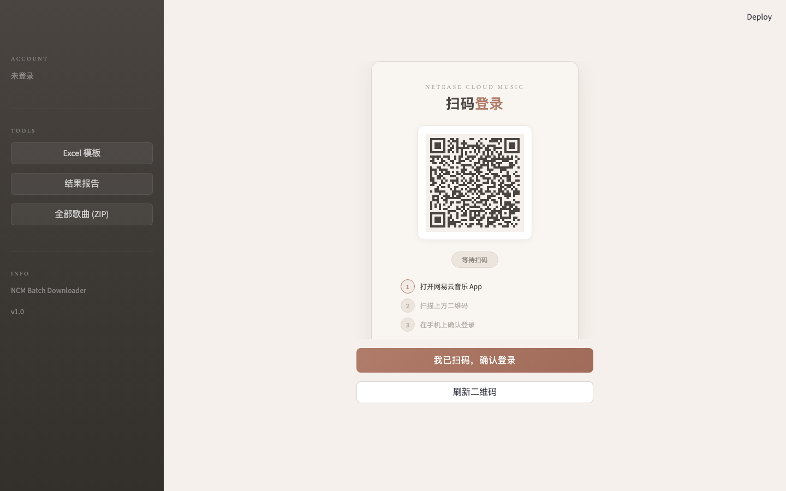
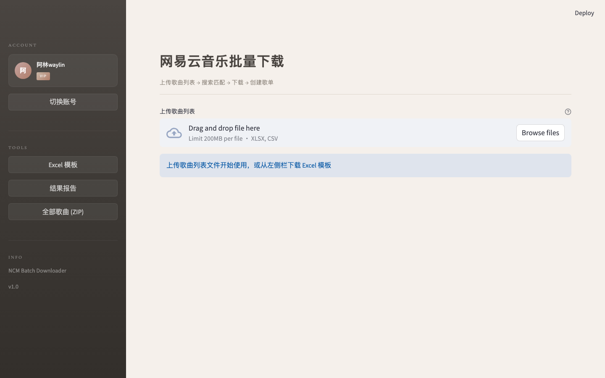

# NCM Playlist - 网易云音乐批量下载工具

批量搜索、下载网易云音乐歌曲并自动创建歌单。支持 Web 界面和命令行两种使用方式。

Batch search, download songs from NetEase Cloud Music and auto-create playlists. Supports both Web UI and CLI.

## Screenshots

### Login - QR Code Scan / 登录页



### Main Interface / 主界面



---

## Features / 功能特性

- **Batch Search / 批量搜索** - Import from Excel/CSV, smart matching (name 60% + artist 30% + album 10%)
- **Batch Download / 批量下载** - Multiple quality options (128kbps / 192kbps / 320kbps / Lossless FLAC)
- **Auto Playlist / 自动建歌单** - Create playlists by category, skip existing duplicates
- **Resume / 断点续传** - Continue from where you left off after interruption
- **QR Login / 扫码登录** - Scan with phone, session auto-cached
- **Web UI / Web 界面** - Streamlit visual interface, friendly for non-developers
- **CLI / 命令行** - For batch automation
- **macOS Packaging / macOS 打包** - One-click PyInstaller build to `.app`

---

## Quick Start / 快速开始

### Requirements / 环境要求

- Python 3.10+
- NetEase Cloud Music VIP account (required for high-quality downloads)

### Installation / 安装

```bash
git clone https://github.com/waylinwang/ncmplaylist.git
cd ncmplaylist
python -m venv .venv
source .venv/bin/activate
pip install -r requirements.txt
```

### Web UI (Recommended / 推荐)

```bash
streamlit run app.py
```

Open `http://localhost:8501` in your browser, scan QR code to login, then upload your song list.

浏览器打开 `http://localhost:8501`，扫码登录后上传歌曲列表即可。

### CLI / 命令行

```bash
# Generate Excel template / 生成 Excel 模板
python main.py template

# QR code login / 扫码登录
python main.py login

# Full pipeline: search + download + create playlists / 完整流程
python main.py run songs.xlsx

# Search + playlist only (no download) / 仅搜索+建歌单
python main.py run songs.xlsx --no-download

# Search + download only (no playlist) / 仅搜索+下载
python main.py run songs.xlsx --no-playlist

# Resume from last progress / 断点续传
python main.py run songs.xlsx --resume

# Specify quality (lossless) / 指定音质（无损）
python main.py run songs.xlsx --bitrate 999000

# View progress report / 查看进度
python main.py report
```

---

## Excel Template Format / Excel 模板格式

| Song Name 歌曲名称 | Artist 歌手 | Album 专辑 | Category 分类/歌单 | Note 备注 |
|---|---|---|---|---|
| 晴天 | 周杰伦 | 叶惠美 | 华语经典 | |
| Shape of You | Ed Sheeran | | Pop Hits | |

- **Song Name** (required) - used for search
- **Artist** - improves matching accuracy
- **Album** - optional, assists matching
- **Category** - auto-creates playlist per category
- **Note** - not processed

## Quality Options / 音质选项

| Option | Bitrate | Note |
|---|---|---|
| Standard 标准 | 128kbps | Free users |
| High 高品 | 192kbps | - |
| Ultra 极高 | 320kbps | VIP (default) |
| Lossless 无损 | FLAC | VIP |

---

## macOS Packaging / macOS 打包

```bash
python build_mac.py
```

Generates `dist/neteasymusic.app` (approx. 218MB). Double-click to run - no Python installation required.

生成 `dist/neteasymusic.app`，双击即可运行，无需安装 Python。

---

## Project Structure / 项目结构

```
ncmplaylist/
├── app.py                 # Streamlit Web UI
├── main.py                # CLI entry point
├── config.py              # Configuration constants
├── auth.py                # QR login & session management
├── search.py              # Song search & smart matching
├── downloader.py          # Song download & metadata writing
├── playlist_manager.py    # Playlist creation (auto dedup)
├── excel_handler.py       # Excel/CSV read & write
├── progress_tracker.py    # Resume support (progress tracking)
├── utils.py               # Retry, rate limiting, utilities
├── launcher.py            # PyInstaller entry point
├── build_mac.py           # macOS build script
├── requirements.txt       # Python dependencies
├── 启动工具.command        # macOS double-click launcher
└── template/              # Excel template
```

---

## Notes / 注意事项

- High-quality downloads require a NetEase Cloud Music VIP account
- Default request interval is 0.8s to avoid API rate limiting
- Max 500 songs per playlist, auto-split if exceeded
- Session cached in `.session_cache` file; delete it to re-login
- This tool is for personal study and research use only

## Support / 赞赏

If this tool is helpful, consider sponsoring to support development!

如果这个工具对你有帮助，欢迎赞赏支持开发者！

[](https://github.com/sponsors/waylinwang)

| WeChat Pay 微信赞赏 | Alipay 支付宝 |
|:---:|:---:|
|  |  |

## License

MIT
